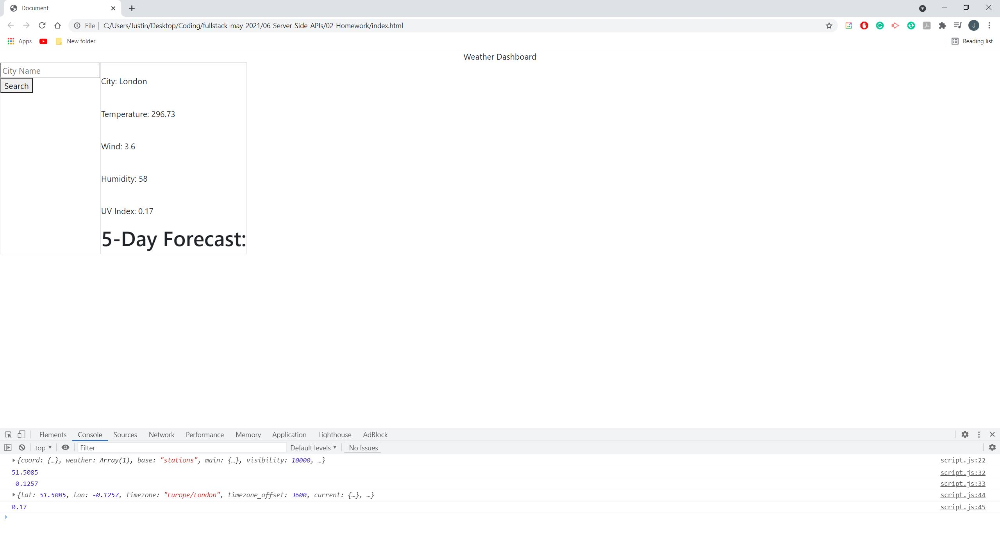
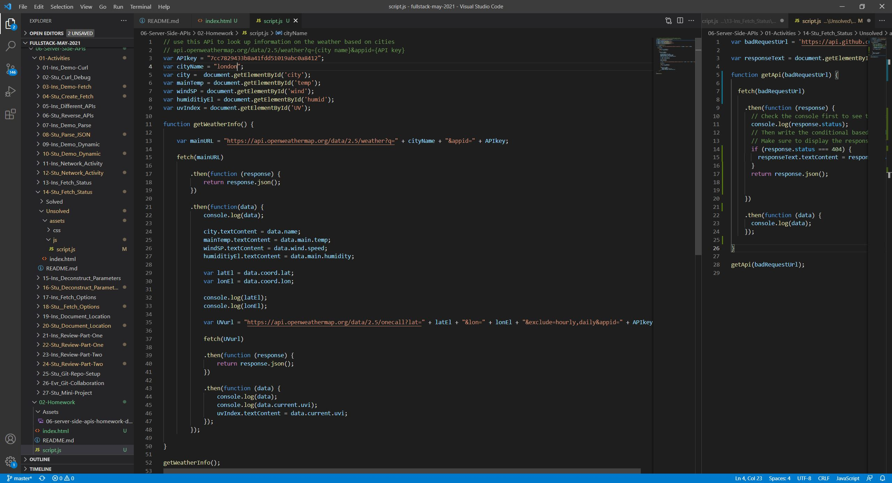
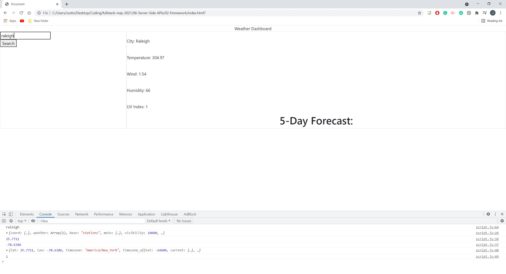
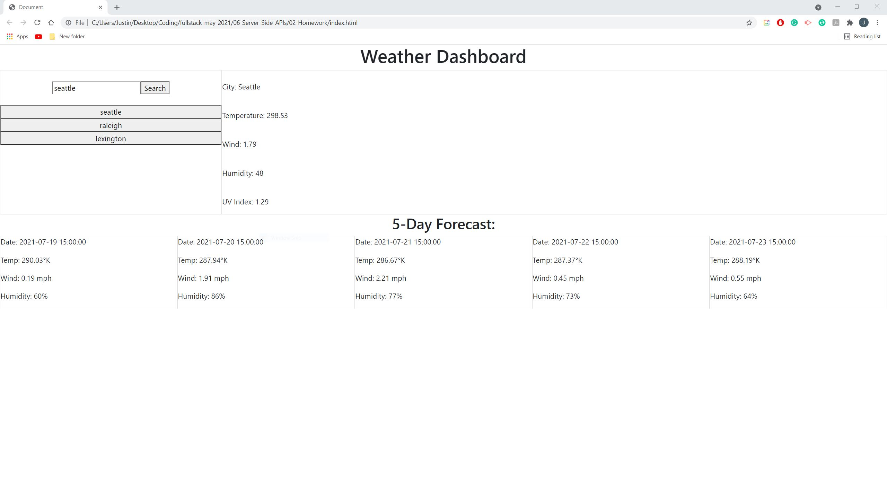
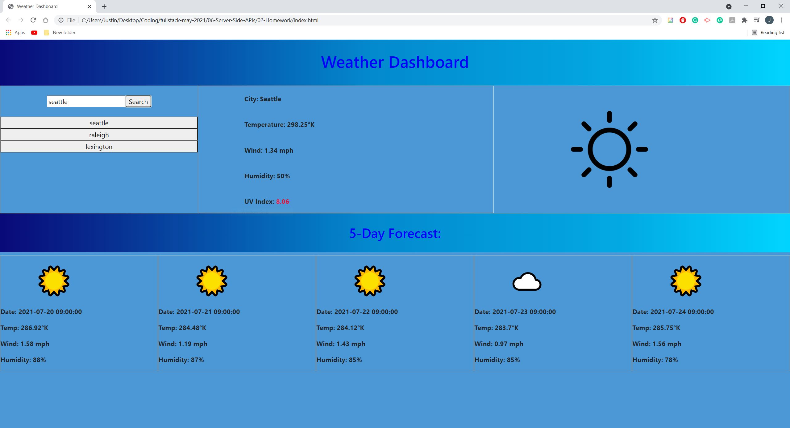
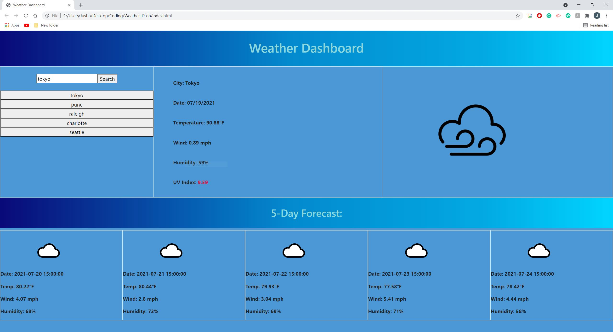

# Planner-Application - HW
Calendar/Date Planner

## Overview/Description
Start by typing a city of your choosing, then be prompted with information includng a temperature, humidity, wind speed, and UV index, below the current weather information will be a 5 day forecast of the weather in the given city, all previous citys will be stored and saved unless user decides to clear history.

## Goal
GIVEN a weather dashboard with form inputs
WHEN I search for a city
THEN I am presented with current and future conditions for that city and that city is added to the search history
WHEN I view current weather conditions for that city
THEN I am presented with the city name, the date, an icon representation of weather conditions, the temperature, the humidity, the wind speed, and the UV index
WHEN I view the UV index
THEN I am presented with a color that indicates whether the conditions are favorable, moderate, or severe
WHEN I view future weather conditions for that city
THEN I am presented with a 5-day forecast that displays the date, an icon representation of weather conditions, the temperature, the wind speed, and the humidity
WHEN I click on a city in the search history
THEN I am again presented with current and future conditions for that city

## Screeshots/Image
--Basic rough draft of the Application--

--Basic rough draft of the code--

-- Current Weather shown --

-- 5 Day Forecast shown --

-- Final Application Design --

-- Final Product --

## Working Application
Github: https://github.com/jyliao369/Weather_Dash

Application: https://jyliao369.github.io/Weather_Dash/
